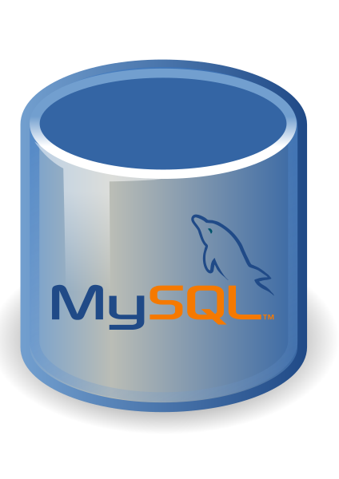

# This is the website project for a healing company

## Frontend: React.js
Frontend: React.js
 

## Backend: Django (Python framework)
Backend: Django (Python framework)
 

## Database: MySQL
Database: MySQL
 

